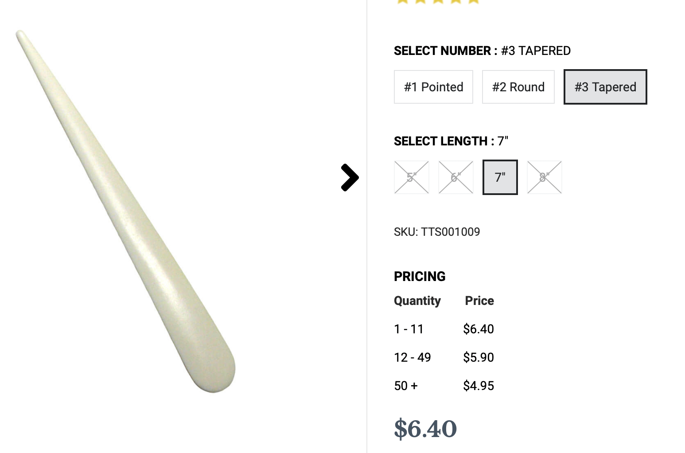
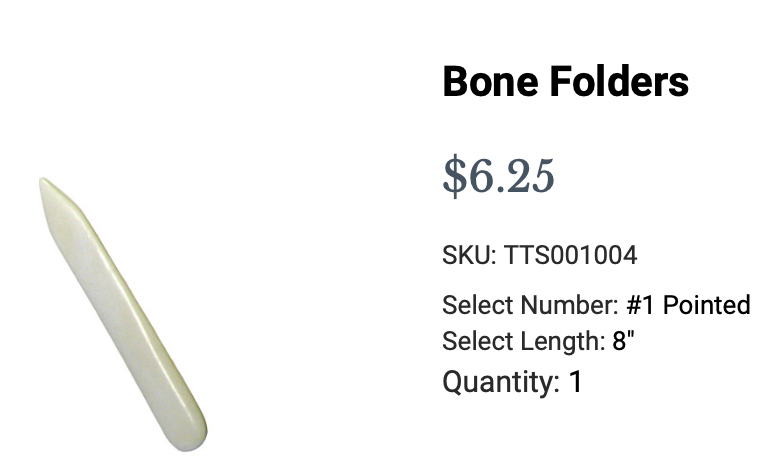

# Trevor's 2021 Birthday / Christmas List

### Bone folders

##### Paper folding tools made of genuine bone
- like $7 each
- <https://www.talasonline.com/Bone-Folders?quantity=1&number=354&length=44>>

### foreverspin

##### Silver top, stainless steel base.
- <https://foreverspin.com>
- Does it really make sense to spend $200 on a top? No. Do I still want it? Yes!

### Everdrive GBA Mini

##### Lets me play every GameBoy Advance game there is
- <https://everdrive.me/cartridges/everdrive-gba-x5-mini.html>
- I already have the old version of this, which sticks out from the top. This one is flush!
- I like the graphite color the best, but the translucent smoke is cool too. The red sucks though.

### Everdrives
- <https://everdrive.me>
- Here are the other everdrives I still need:
    + [TurboGrafx](https://everdrive.me/cartridges/turbo-everdrive-v2.html) ($69)
    + [GameBoy Color](https://everdrive.me/cartridges/edgbx7.html) ($103)
    + [NES](https://everdrive.me/cartridges/everdrive-n8-pro-nes.html) ($135)
    + [Sega Genesis](https://everdrive.me/cartridges/mega-everdrive-pro.html) ($159)

