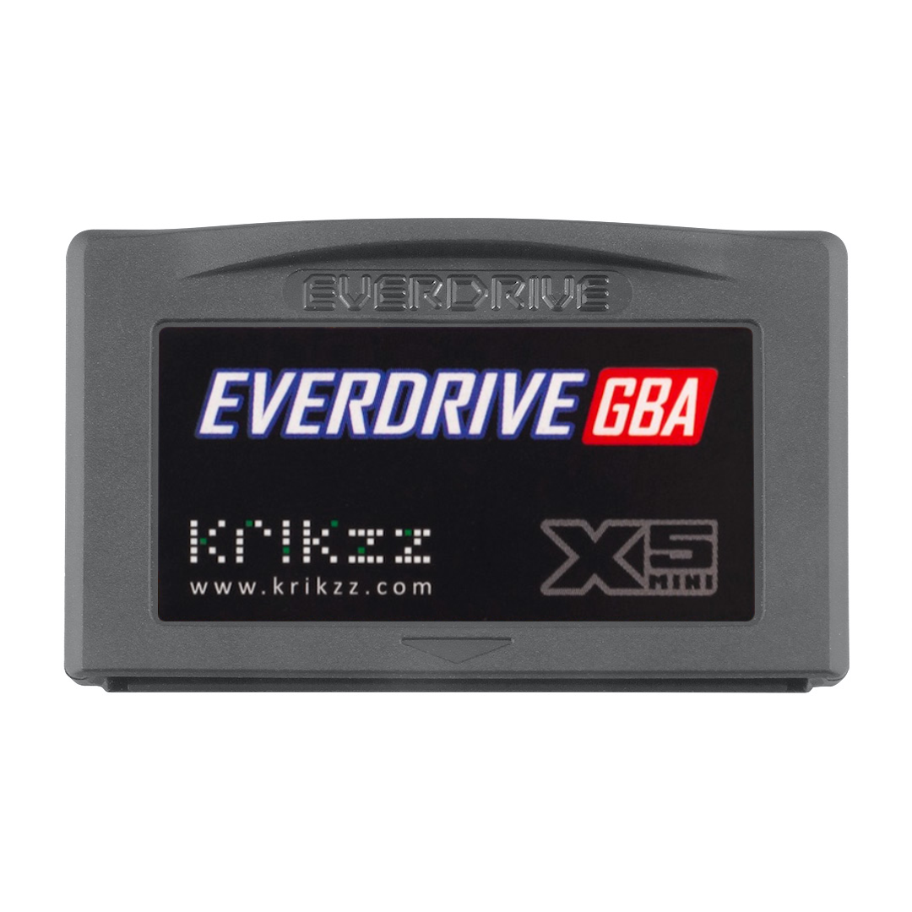

# Trevor's 2021 Birthday / Christmas List

### Apple Magic Mouse Space Gray

##### (Color discontinued by Apple, get it on eBay)
- around $70
- example listing: [www.ebay.com](https://www.ebay.com/itm/265240176934?var=565112123482&_trkparms=amclksrc%3DITM%26aid%3D1110006%26algo%3DHOMESPLICE.SIM%26ao%3D1%26asc%3D235118%26meid%3D0c3f131146a44a89a941dac63fa40d94%26pid%3D101195%26rk%3D3%26rkt%3D12%26sd%3D133933952532%26itm%3D565112123482%26pmt%3D1%26noa%3D0%26pg%3D2047675%26algv%3DSimplAMLv9PairwiseWebMskuAspectsV202110NoPLXNoVariantSeed&_trksid=p2047675.c101195.m1851&amdata=cksum%3A2652401769340c3f131146a44a89a941dac63fa40d94%7Cenc%3AAQAGAAACMGpL8dDvwve6vLI7KSnCXP00PWgxEp7aLh0%252FvbgmkiaA7F8n%252FV47zRJAInO0ceJNQ81ADBC%252FBkDDvIqkQm0CkRg5Jdr2uLUcuEs6H4EYK%252BMQmqMYCAuHW7ZNbmvc9FN3y2urWkEYN2doYPN24mFBPVOpEoGyYaRrP6UAyIdIodHaNtdrEDqLCLjaYX7jDFb7Nj6QVA023zmDx%252Fd%252B1GeeGg4P%252FCJkXkozjRHQCnG8WWrhp8ybR6KfusRxa4a6Q6V3aGBJKs1L0huCJN1nGbiEh25bKVhjcMa1q5X7dT7z%252BIgpwqaykT428CkTvN5W7OKDoD7z7dI69EaCFSYsgYyfHH9b%252BzKZDTrAbwT0OSrClmB0h7c%252FBxbStRlqtbkDXr5hqJMV%252FVQtJX1VWPEkVYW2AuFj2Z2fbVf6GWGh9DQpFDunDHSEjHB62DenBaSTJJBigwCe1w%252BVdDYaH%252BFl0W5f%252BD9B%252BxNplIOgGziTufxwE4T%252Bvj94%252BBWVs811wxG7YAMsTVsdZ0PCTrkk6gDSGIek9dwqcU5vRVM2%252BCLD6a8jhKhrlk%252Fk8UEP9FA8ww18f6gWBlu2qJ9eO2cryZ6NnWhZFBFgIQg35Pm%252BcYYYnuOjKFavF0TSPEHwp06Dr6dSIZxo8GkgmyDh7WSJTTovRrPtI52Hu5YwiFu4%252BPeFX9CPpq18zRhd3dZs%252BG4XvhJAmc6a5c0PFdKd02y3etvfrZVXE1wHPCg6UeryxKohQc9zip13%7Campid%3APL_CLK%7Cclp%3A2047675)

### foreverspin

##### Silver top, stainless steel base.
- <https://foreverspin.com>
- Does it really make sense to spend $200 on a top? No. Do I still want it? Yes!

### Everdrive GBA Mini

##### Lets me play every GameBoy Advance game there is
- <https://everdrive.me/cartridges/everdrive-gba-x5-mini.html>
- I already have the old version of this, which sticks out from the top. This one is flush!
- I like the graphite color the best, but the translucent smoke is cool too. The red sucks though.

### Everdrives
- <https://everdrive.me>
- Here are the other everdrives I still need:
    + [TurboGrafx](https://everdrive.me/cartridges/turbo-everdrive-v2.html) ($69)
    + [GameBoy Color](https://everdrive.me/cartridges/edgbx7.html) ($103)
    + [NES](https://everdrive.me/cartridges/everdrive-n8-pro-nes.html) ($135)
    + [Sega Genesis](https://everdrive.me/cartridges/mega-everdrive-pro.html) ($159)

### Stone Dice

- Here's an example, doesn't have to be this exact product
- <https://www.ebay.com/itm/183536551690?epid=1984223773&hash=item2abba1870a:g:WQQAAOSwI7Fb7Nhl>
- I'm looking for real stone, carved and polished into D&D dice. I think Red Jasper would be cool, but it could be any cool stone, you can follow your heart on that part. I'd love to have all: d4, d6, d8, d10, d12, d20, and d%, but if that's not possible then six to ten d10s would be cool (for fireball purposes).
